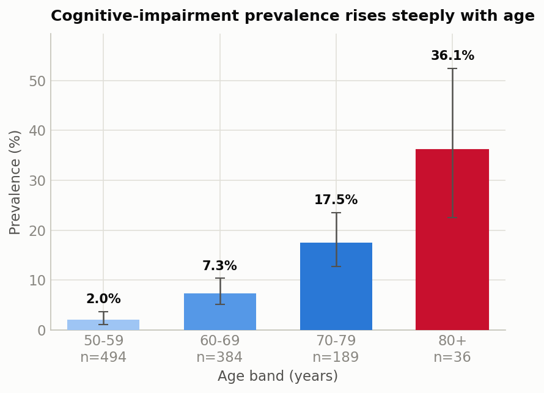
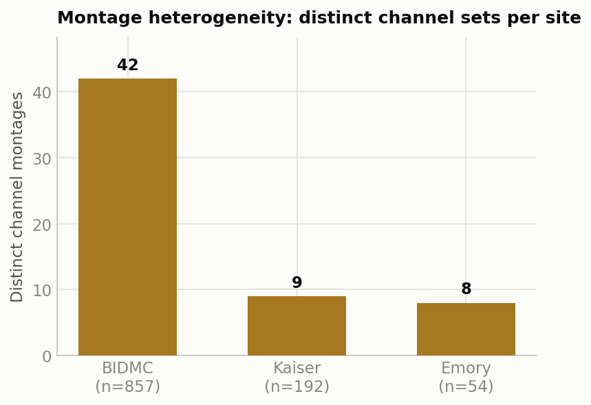
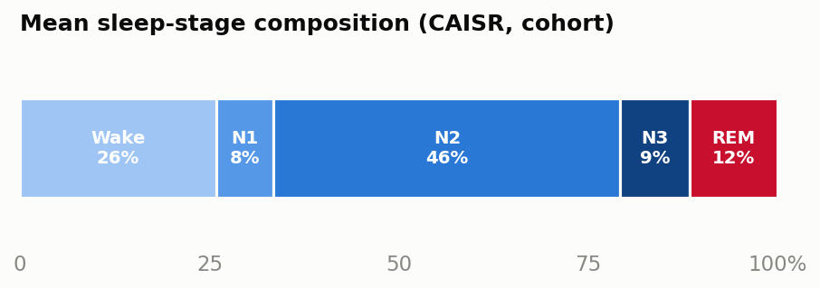
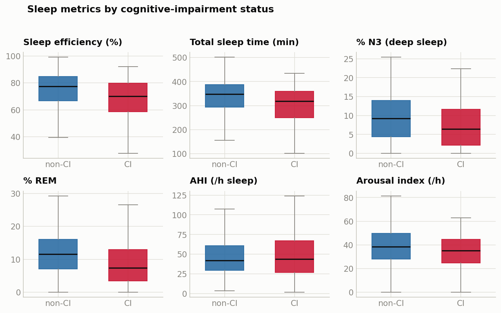

# Confounder-Resistant Prediction of Cognitive Impairment from Overnight Sleep Studies with Site-Aware Gradient Boosting

**Arshia Ilaty — SDG, USA**
*Prepared for Computing in Cardiology 2026 (PhysioNet Challenge track). This is a readable mirror of `cinc2026_sdg.tex`. Cells marked `[FILL]` must be completed from `eda/loso_cv_*.json` before submission.*

---

## Abstract

We describe our entry to the George B. Moody PhysioNet Challenge 2026, which asks participants to predict cognitive impairment from a single overnight polysomnogram (PSG) and demographics. The Challenge ranks entries by a prevalence-weighted **reward** that neutralizes trivial classifiers and, through age-conditioned scoring, penalizes models that merely relearn the age–risk gradient. We therefore designed a pipeline around two principles: robustness to multi-site distribution shift, and resistance to age as a confounder. Rather than raw EEG, we compute interpretable features from algorithmic sleep annotations (CAISR): sleep macro-architecture, fragmentation, and respiratory/limb/arousal event indices, combined with ECG-derived heart-rate variability, oxygen-desaturation burden, and non-age demographics. A per-site histogram gradient-boosting ensemble with isotonic calibration produces probabilities, thresholded at the prevalence-optimal operating point. Under leave-one-site-out (LOSO) cross-validation scored with the official metric, our system attains a reward of **0.168**. We further derive the Bayes-optimal decision rule for the Challenge reward and show it is an *age-specific* threshold, motivating our roadmap for the official phase.

## 1. Introduction

Sleep disturbance is both an early symptom and a putative driver of neurodegeneration. Overnight PSG is widely acquired, richly informative, and increasingly annotated by automated systems, making it an attractive substrate for scalable cognitive-impairment screening. The George B. Moody PhysioNet Challenge 2026 formalizes this task: given one overnight recording and demographic metadata per patient, predict a binary cognitive-impairment label and an associated probability.

Two aspects of the Challenge scoring shape the modeling problem:

1. **The positive class is rare**, so accuracy is uninformative. The primary metric is a prevalence-weighted *reward* that pays disproportionately for correctly identifying rare positives and charges a fixed penalty for every error.
2. **The diagnostic metrics are age-aware.** Age-conditioned and age-weighted AUROCs compare only patients of similar age, so a model that predicts impairment simply because a patient is old is not rewarded.

Data are pooled from multiple clinical sites, introducing distribution shift between the visible training sites and the hidden validation/test sites. Our contribution is a deliberately **confounder-resistant** and **shift-aware** design, validated with leave-one-site-out cross-validation using the official scoring code, together with a short theoretical result that characterizes the optimal decision threshold.

## 2. Methods

### 2.1 Data and labels
Each patient contributes an EDF PSG, a CAISR algorithmic-annotation file, and a demographics row (age, sex, BMI, race, ethnicity, and follow-up fields `Time_to_Event`, `Time_to_Last_Visit`). The target is the binary `Cognitive_Impairment` label. Data are streamed directly from cloud object storage without materializing the ~130 GB archive on local disk.

### 2.2 Dataset characteristics

The training release comprises **1103 single-session recordings** from three clinical sites. The positive class is rare (**prevalence 7.6%**) and uneven across sites (6.5–14.8%), so both the reward's rarity weighting and cross-site validation matter.

**Table — Training cohort by site (prevalence, 95% Wilson CI):**

| Site | Patients | Positives | Prevalence % (95% CI) |
|---|--:|--:|---|
| BIDMC (S0001) | 857 | 56 | 6.5 (5.1–8.4) |
| Kaiser (I0006) | 192 | 20 | 10.4 (6.8–15.5) |
| Emory (I0002) | 54 | 8 | 14.8 (7.7–26.6) |
| **Total** | **1103** | **84** | **7.6 (6.2–9.3)** |

Critically, prevalence climbs monotonically with age — **2.0% (50–59) → 7.3% (60–69) → 17.5% (70–79) → 36.1% (80+)** — exactly the shortcut the age-conditioned metric neutralizes, and the reason we exclude age from the model. BMI is missing for **75.9%** of patients and `Time_to_Event` for 92.4%, motivating NaN-tolerant models and site-median imputation.

Physiological recordings last a median of **7.6 h** but show severe channel heterogeneity: canonicalizing on the channel *set*, BIDMC alone presents **42 distinct montages**, with inconsistent labels (`F3-M2` vs. `F3`), sampling rates (200–512 Hz), and even mislabeled units (854 SpO₂ channels tagged `uV` not `%`). This raw-signal fragility motivates our use of harmonized CAISR annotations over raw waveforms; CAISR staging agrees with expert scoring on **76%** of epochs.

Patients with cognitive impairment trend toward lower sleep efficiency and reduced deep/REM sleep:

### 2.3 Feature extraction
We avoid raw-waveform EEG features; an ablation (§3) showed EEG/EOG/chin channels gave no cross-site benefit while adding montage-dependent fragility. We derive three interpretable blocks:

- **Sleep architecture (CAISR).** Stage percentages (W/N1/N2/N3/REM), sleep efficiency, latencies (sleep, REM, N3), WASO, stage-transition rate, stage entropy, per-stage bout statistics (counts, mean bout duration, REM fragmentation, slow-wave density); event indices — apnea–hypopnea, arousal, periodic-limb-movement — plus event subtypes (obstructive/central apnea, hypopnea, RERA; isolated vs. periodic limb movements) and mean model-confidence signals.
- **Autonomic.** From ECG: mean heart rate, SDNN, RMSSD (via band-pass + peak detection). From SpO₂: mean and 1st-percentile saturation, fraction of time below 90%, variability, desaturation-event index.
- **Demographics without age.** Sex, BMI, race, ethnicity encoded. **Age is intentionally excluded** to prevent the classifier from exploiting the age–risk correlation that the age-aware metrics discount. Missing BMI is imputed with the site-specific median, falling back to the global median.

### 2.4 Classifier and calibration
Each feature vector is classified by a histogram-based gradient-boosting model (`HistGradientBoostingClassifier`; 400 iterations, learning rate 0.05, 31 leaves, ℓ₂ = 1, early stopping), chosen for native missing-value handling and strong tabular performance. Probabilities are isotonically calibrated by cross-validation when class counts permit — the reward is threshold-sensitive, so calibration matters.

### 2.5 Site-aware ensemble
To address inter-site distribution shift we fit a mixture of experts: one gradient-boosting model per site with sufficient support (both classes present), plus a global model trained on all sites. At inference the site-specific model is used when available, else the global model.

### 2.6 Decision threshold and its optimality
Let `q = P(y=1 | x)` be the calibrated probability and `p` the prevalence of the positive class. Under the Challenge reward, a positive prediction yields expected reward `q(1/p − 1) − (1 − q)` and a negative prediction yields `−q + (1 − q)(1/(1 − p) − 1)`. Predicting positive is optimal when the former dominates, which simplifies to:

> **q / p ≥ (1 − q) / (1 − p)  ⟺  q > p.**   *(Eq. 1)*

The Bayes-optimal rule is therefore to predict positive exactly when the calibrated probability exceeds the prevalence. Because the Challenge defines prevalence **per age**, the optimal threshold is age-specific, `q > p(age)`, not a constant. Our current submission uses the global prevalence as a robust approximation; Eq. 1 motivates the age-specific refinement in §4.

### 2.7 Validation protocol
We estimate generalization with leave-one-site-out (LOSO) cross-validation: train on all-but-one site, predict on the held-out site, and score with the official `evaluate_model.py`. This mirrors the hidden-test condition, in which evaluation sites are not represented in training.

## 3. Results

Our system attains a reward of **0.168** under the official metric. Because random, all-positive, and all-negative classifiers score ≈ 0 at any prevalence, a positive reward reflects genuine predictive skill rather than exploitation of the base rate.

**Table 1 — Pooled leave-one-site-out performance (official metrics).**

| Metric | Value |
|---|---|
| Reward (primary) | **0.168** |
| Age-conditioned AUROC | `[FILL]` |
| Age-weighted AUROC | `[FILL]` |
| AUROC | `[FILL]` |
| AUPRC | `[FILL]` |

**Table 2 — Feature-group ablation (pooled LOSO).** Complete from `ablation_v*.json`.

| Configuration | AUROC | age-AUROC | Reward |
|---|---|---|---|
| All features | `[FILL]` | `[FILL]` | `[FILL]` |
| Signal + CAISR (no demographics) | `[FILL]` | `[FILL]` | `[FILL]` |
| CAISR only | `[FILL]` | `[FILL]` | `[FILL]` |
| Drop EEG block | `[FILL]` | `[FILL]` | `[FILL]` |
| Drop autonomic block | `[FILL]` | `[FILL]` | `[FILL]` |
| No age (submission) | `[FILL]` | `[FILL]` | **0.168** |

The ablation supports two design decisions: removing the EEG/EOG/chin block did not reduce cross-site performance, and removing age improved the age-aware metrics and the reward, consistent with the metric's confounder-resistant design. Per-site folds (BIDMC, Emory, Kaiser) appear in the supplementary results.

## 4. Discussion

Our results indicate that interpretable, annotation-level sleep features, combined with autonomic markers and non-age demographics, carry a genuine and site-transferable signal for cognitive impairment. The confounder-resistant design — excluding age and validating only across sites — targets generalization to the hidden test set rather than to the visible training sites.

Equation 1 identifies the clearest improvement for the official phase: replacing the global-prevalence threshold with the age-specific optimum `q > p(age)`. This is contingent on good **cross-site** calibration, so our roadmap pairs it with per-fold reliability analysis and, if needed, cross-site recalibration. Further planned work: site-adversarial (domain-invariant) training to shrink the LOSO generalization gap; a calibrated ensemble with a linear member for robustness under shift; and — more speculatively — survival-aware label handling that exploits the follow-up fields to de-noise censored negatives. Every addition is gated on improving pooled LOSO reward without degrading the weakest site.

**Limitations.** Only three visible training sites (limiting the diversity of shift we can model); reliance on CAISR annotation availability/quality at test time (mitigated by NaN-tolerant models + global fallback); and label noise from right-censored follow-up.

## 5. Conclusion

We presented a confounder-resistant, site-aware system for predicting cognitive impairment from overnight sleep studies that achieves a leave-one-site-out reward of 0.168 under the official Challenge metric. By grounding feature and threshold choices in the structure of the reward — and by deriving its Bayes-optimal, age-specific decision rule — we obtain a design that is both interpretable and directly aligned with how the Challenge is scored.

## References

1. George B. Moody PhysioNet Challenge 2026. https://physionetchallenges.org/2026/
2. Goldberger AL, et al. PhysioBank, PhysioToolkit, and PhysioNet. *Circulation* 2000;101(23):e215–e220.
3. Pedregosa F, et al. Scikit-learn: Machine Learning in Python. *JMLR* 2011;12:2825–2830.
4. Zadrozny B, Elkan C. Transforming classifier scores into accurate multiclass probability estimates. *KDD* 2002.
5. Ganin Y, et al. Domain-adversarial training of neural networks. *JMLR* 2016;17(59):1–35.
6. Ju YS, Lucey BP, Holtzman DM. Sleep and Alzheimer disease pathology — a bidirectional relationship. *Nat Rev Neurol* 2014;10(2):115–119.

---
*Correspondence: Arshia Ilaty, SDG — [email address].*
